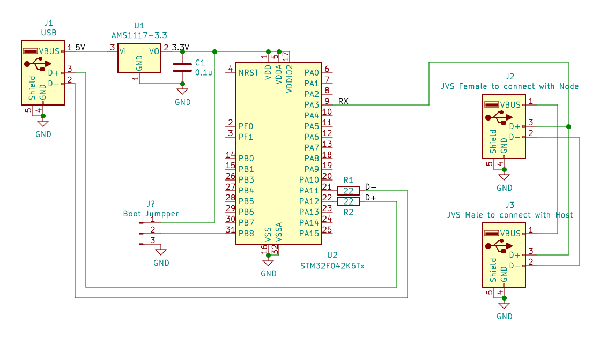

# JVSMonitor
STM32 firmware and tools to monitor JVSIO.

## Schematics


J3 and J2 are pass-through JVS connectors. D+ signal should be monitored by the STM32 to dump protocols.
J1 is a standard USB connector to connect with PC. It will be used to write firmware, or to be a USB serial peripheral.
Sniffed data should be dumped via the USB serial port, thus PC decode them to show in the wireshark porotocol analyzer.
AMS1117-3.3 can be replaced with any other components to generate 3.3V.

## Firmware
Prebuilt firmware for the STM32F042K6T6 is submitted in the Release/ directory.
If J4 Boot jumpper shorts 1 and 2, the STM32 appears as a DFU device when the J1 USB is connected to the host PC.
[STM32CubeProgrammer](https://www.st.com/en/development-tools/stm32cubeprog.html) can be used to write the firmware via the DFU interface.
You don't need any extra device to program it.

Once you write the firmware, replace the jumpper to short 2 and 3. Thus, it appears as a JVSMonitor USB device when it is connected to the host PC next time.

## Tools
The deivce just monitors the JVS I/O transaction, and dump raw data to the USB serial port.
The host PC needs to analyze the dump to see actual transactions.

Default toolchains expect Wireshark running on Linux to show JVS I/O dump.

### jvs2pcap
Tools/jvs2pcap directory contains the tool, jvs2pcap. You can build it by ```make```.

```shell
$ ./jvs2pcap /dev/ttyACM0
```

```ttyACM0``` can be changed depending on your environment. It's the device path for the USB serial given by the JVSMonitor. It creates a named pipe, ```jvsio.fifo```, and Wireshark can open such fifo file instead of the raw network devices.

jvs2pcap converts the JVS I/O dumps to data streams in the pcap format with pseudo packet headers so that Wireshark and its plugins can recognize.

### jvsio.lua
Tools/jvsio.lua is a Wireshark plugin to parse the JVS I/O dump. This file should be placed at ```~/.config/wireshark/plugins```. Please check Wireshark documents for details.

### Wireshark
1. Select ```Capture > Options...``` from the menu to show a ```Capture Interfaces``` dialog.
2. Push ```Manage Interfaces...``` button to show a ```Manage Interfaces``` dialog.
3. Select ```Pipes``` tab, push ```+``` button, then doubleclick ```New Pipe``` item that appeared by pushing ```+```.
4. Push ```Browse``` button to select the ```jvsio.fifo``` pipe, then clink ```OK``` to finish.
5. Now you can see the pipe in the ```Input``` tab to select for capturing.
